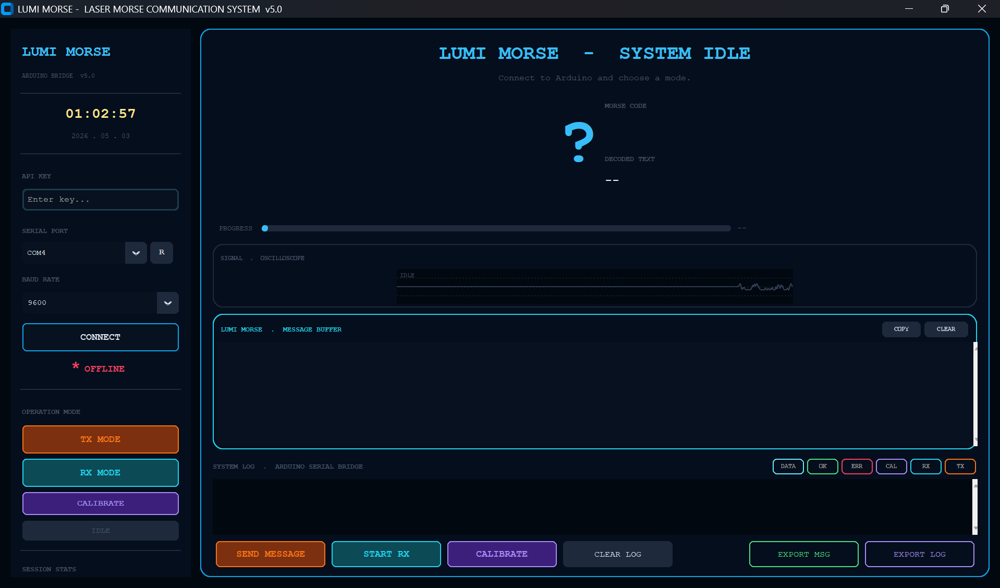
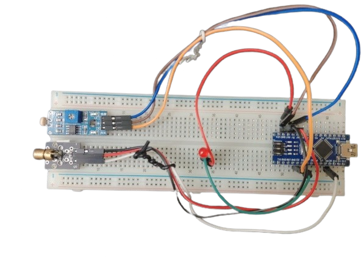

<div align="center">
⭐ If this project sparked something in you, drop a star! ⭐

</div>
<div align="center">


```
██╗      ██╗   ██╗███╗   ███╗██╗    ███╗   ███╗ ██████╗ ██████╗ ███████╗███████╗
██║      ██║   ██║████╗ ████║██║    ████╗ ████║██╔═══██╗██╔══██╗██╔════╝██╔════╝
██║      ██║   ██║██╔████╔██║██║    ██╔████╔██║██║   ██║██████╔╝███████╗█████╗  
██║      ██║   ██║██║╚██╔╝██║██║    ██║╚██╔╝██║██║   ██║██╔══██╗╚════██║██╔══╝  
███████╗ ╚██████╔╝██║ ╚═╝ ██║██║    ██║ ╚═╝ ██║╚██████╔╝██║  ██║███████║███████╗
╚══════╝  ╚═════╝ ╚═╝     ╚═╝╚═╝    ╚═╝     ╚═╝ ╚═════╝ ╚═╝  ╚═╝╚══════╝╚══════╝
```

### ◈ &nbsp; L U M I &nbsp; M O R S E &nbsp; · &nbsp; A R D U I N O &nbsp; ◈

<br/>

<p align="center">
  
  
  
  
  
</p>

<p align="center">
  
  
  
</p>

<br/>

> **LumiMorse** is an Arduino-powered optical communication system that encodes text as **Morse code**, fires it across the room as a **laser beam**, and decodes it live on the receiving side using an **LDR sensor** — all displayed inside a futuristic dark-themed Python HUD.

<br/>

</div>

---

## 📡 Table of Contents

- [About the Project](#-about-the-project)
- [Screenshots](#-screenshots)
- [Block Diagram](#-block-diagram)
- [Features](#-features)
- [Hardware Requirements](#-hardware-requirements)
- [Pin Configuration](#-pin-configuration)
- [Circuit Connections](#-circuit-connections)
- [Morse Timing Reference](#-morse-timing-reference)
- [Serial Protocol](#-serial-protocol)
- [Tech Stack](#-tech-stack)
- [Prerequisites](#-prerequisites)
- [Installation & Setup](#-installation--setup)
- [How to Use](#-how-to-use)
- [GUI Modes & Themes](#-gui-modes--themes)
- [Project Structure](#-project-structure)
- [Known Issues & Future Improvements](#-known-issues--future-improvements)
- [License](#-license)
- [Author](#-author)

---

## <a id="about-the-project"></a>🔭 About the Project

**LumiMorse** is a real-world wireless communication project built entirely on Arduino and Python. The sender side encodes a typed message into Morse Code and transmits it as timed laser pulses. The receiver side listens via an LDR (Light Dependent Resistor), interprets the pulse durations, decodes each light pulse back into text, and streams it live to a GUI.

Key highlights from the codebase:

- The **Python GUI** (`lumi_morse_hud.py`) is built with `customtkinter` and styled with a deep-space dark colour palette — featuring an animated oscilloscope, scrolling hex-rain sidebar, live Morse dot/dash visualiser, and per-mode full UI colour theme switching.
- The **Arduino firmware** (`lumi_morse_.ino`) handles Morse encoding + decoding, laser control, buzzer + LED feedback, a non-blocking LDR receive loop, and a live calibration routine — all over a simple serial command protocol.
- A **TX Message Composer** dialog (full-screen, maximised) shows a live Morse preview and symbol count as you type.
- A dedicated **LDR Calibration panel** renders a live bar chart of 0/1 sensor readings so you can physically align the laser to the LDR.

---

## <a id="demo-videos"></a>📸 Screenshots

### 🖥️ Main HUD — Home Screen
> Scrolling hex-rain sidebar (left), live clock, session stats, oscilloscope panel, system log, and message buffer — all in the deep-space dark theme.



## <a id="block-diagram"></a>🔷 Block Diagram

```
╔═══════════════╗         ╔══════════════════╗                      ╔══════════════════╗         ╔═══════════════╗
║  SENDER GUI   ║         ║   Arduino  TX    ║                      ║   Arduino  RX    ║         ║ RECEIVER GUI  ║
║               ║         ║                  ║   LASER  ·−·· ∿∿∿   ║                  ║         ║               ║
║  Type message ║──Serial─▶  Encodes Morse   ║─────────────────────▶  LDR detects    ║──Serial─▶ Displays text ║
║  customtkinter║  (USB)  ║  Fires laser     ║      optical beam    ║  Decodes timing  ║  (USB)  ║  customtkinter║
║               ║         ║  LED + Buzzer    ║                      ║  LED + Buzzer    ║         ║               ║
╚═══════════════╝         ╚══════════════════╝                      ╚══════════════════╝         ╚═══════════════╝
```
---

## <a id="features"></a>✨ Features

### 🖥️ Python GUI — `lumi_morse_hud.py`

| # | Feature | Description |
|---|---------|-------------|
| 1 | **TX Mode** | Full-screen message composer with live Morse preview, char/symbol counter, and `Ctrl+Enter` to transmit |
| 2 | **RX Mode** | Listens on serial, decodes characters live, updates big char display and message buffer in real time |
| 3 | **Calibration Mode** | Live LDR bar chart (40 readings × 200ms) — adjust potentiometer to align laser on LDR |
| 4 | **Morse Visualiser** | Animated dot/dash block renderer, updates per character in both TX and RX |
| 5 | **Oscilloscope Panel** | Animated signal waveform — colour and amplitude change per active mode |
| 6 | **HexRain Sidebar** | Scrolling matrix-style hex digit animation layered behind the sidebar controls |
| 7 | **Per-Mode UI Themes** | Full colour overhaul on every mode switch (TX = orange · RX = cyan · CAL = purple) |
| 8 | **Session Stats** | Tracks TX chars, RX chars, errors, and messages — live updated every 400ms |
| 9 | **Live Clock** | Real-time `HH:MM:SS` clock and `YYYY . MM . DD` date in the sidebar |
| 10 | **Export Log** | Save the full timestamped, colour-tagged system log to a `.txt` file |
| 11 | **Export Message** | Save the received message buffer to a `.txt` file |
| 12 | **API Key Auth** | Connection to Arduino is gated behind an API key entry field |
| 13 | **Port Refresh** | Rescan and refresh available COM ports at runtime with one click |

### ⚡ Arduino Firmware — `lumi_morse_.ino`

| # | Feature | Description |
|---|---------|-------------|
| 1 | **Morse Encode** | Full A–Z, 0–9 encode table via `encodeMorse()` |
| 2 | **Morse Decode** | Full A–Z, 0–9 decode table via `decodeMorse()` |
| 3 | **Laser TX** | Fires laser + LED + buzzer per dot/dash with correct inter-symbol timing |
| 4 | **Non-blocking RX Loop** | LDR receive loop uses `millis()` — no `delay()` blocking during reception |
| 5 | **Auto Gap Detection** | Automatically distinguishes letter gaps (750ms) vs word gaps (1750ms) |
| 6 | **Calibration Routine** | Streams 40 raw LDR `0/1` readings over serial for the live GUI chart |
| 7 | **Serial Command Protocol** | Cleanly responds to `TX`, `RX`, and `CAL` commands from the GUI |

---

## <a id="hardware-requirements"></a>🔩 Hardware Requirements

| Component | Qty | Notes |
|-----------|-----|-------|
| Arduino Uno / Nano | 2 | One for TX side, one for RX side |
| Laser Module (5V) | 1 | HW-493 or equivalent |
| LDR Sensor | 1 | With 10kΩ pull-down resistor |
| Potentiometer | 1 | For adjusting LDR detection threshold |
| Active Buzzer | 1 | Audio feedback per dot/dash |
| LED (any colour) | 2 | One per Arduino — visual status indicator per pulse |
| Jumper Wires | — | As needed |
| USB Cables | 2 | One per Arduino (serial + power) |

---

## <a id="pin-configuration"></a>📌 Pin Configuration

```cpp
// ============================================================
//   L U M I M O R S E   ·   A R D U I N O   P I N   M A P
// ============================================================

#define LASER_PIN   9    // OUTPUT — Laser module signal pin
#define LDR_PIN     2    // INPUT  — LDR digital read
#define BUZZER_PIN  3    // OUTPUT — Buzzer audio feedback per pulse
#define LED_PIN     13   // OUTPUT — Status LED per pulse
```

---

## <a id="circuit-connections"></a>🔌 Circuit Connections



### TX Side — Sender Arduino

```
Laser S   →  D9
Laser +   →  5V
Laser -   →  GND

Buzzer +  →  D3
Buzzer -  →  GND

LED +     →  D13
LED -     →  GND
```

### RX Side — Receiver Arduino

```
LDR VCC   →  5V
LDR GND   →  GND
LDR D0    →  D2

Buzzer +  →  D3
Buzzer -  →  GND

LED +     →  D13
LED -     →  GND
```

### Full Connection Reference Table

| Component | Pin | Arduino Side | Direction | Notes |
|-----------|-----|-------------|-----------|-------|
| Laser Signal | D9 | TX | OUTPUT | HW-493 signal pin |
| Laser VCC | 5V | TX | POWER | |
| Laser GND | GND | TX | POWER | |
| LDR VCC | 5V | RX | POWER | |
| LDR GND | GND | RX | POWER | |
| LDR D0 | D2 | RX | INPUT | Via potentiometer voltage divider |
| Buzzer (+) | D3 | TX + RX | OUTPUT | Active buzzer, audio feedback per pulse |
| Buzzer (−) | GND | TX + RX | POWER | |
| LED Anode | D13 | TX + RX | OUTPUT | With 220Ω resistor in series |
| LED Cathode | GND | TX + RX | POWER | |

---

## <a id="morse-timing-reference"></a>⏱️ Morse Timing Reference

| Symbol | Duration | Formula |
|--------|----------|---------|
| **DOT** | 250 ms | Base unit |
| **DASH** | 750 ms | DOT × 3 |
| **Inter-symbol gap** | 250 ms | DOT × 1 |
| **Letter gap** | 750 ms | DOT × 3 |
| **Word gap** | 1750 ms | DOT × 7 |

> The Python GUI mirrors these exact timings locally to animate the progress bar during TX, even before the Arduino confirms `[TX] Done`.

---

## <a id="serial-protocol"></a>📟 Serial Protocol

LumiMorse uses plain-text newline-terminated commands over serial at **9600 baud**.

### GUI → Arduino

| Command | Effect |
|---------|--------|
| `TX <message>\n` | Encodes and transmits the full message as timed laser pulses |
| `RX\n` | Puts Arduino into receive mode, begins LDR monitoring |
| `CAL\n` | Runs calibration — streams 40 LDR readings at 200ms intervals |

### Arduino → GUI

| Message | Meaning |
|---------|---------|
| `LASER LINK READY` | Boot handshake — Arduino is online |
| `RX MODE` | Confirmed receive mode is active |
| `[TX] Sending...` | Laser transmission started |
| `[TX] Done` | Laser transmission complete |
| `CAL MODE - Adjust Pot` | Calibration started |
| `CAL DONE` | Calibration finished |
| `0` / `1` | Raw LDR reading during CAL (`0` = laser detected · `1` = dark) |
| `<char>` / `<word>` | Decoded Morse character streamed live during RX |

---

## <a id="tech-stack"></a>🛠️ Tech Stack

| Technology | Purpose |
|------------|---------|
| **Python 3.8+** | Core application language |
| **customtkinter** | Modern dark-themed GUI framework |
| **tkinter** | Canvas animations — oscilloscope, Morse bar, hex-rain |
| **pyserial** | Arduino serial communication bridge |
| **threading** | Non-blocking serial reader + TX progress animation in parallel |
| **queue** | Thread-safe message passing from serial thread to GUI thread |
| **Arduino C++** | Morse encode/decode, laser TX, LDR RX, buzzer, calibration firmware |

---

## <a id="prerequisites"></a>✅ Prerequisites

Ensure the following are installed before running:

- [Python 3.8+](https://www.python.org/downloads/)
- [Arduino IDE](https://www.arduino.cc/en/software) — to flash the firmware
- The following Python packages:

```bash
pip install customtkinter pyserial
```

> `tkinter` is bundled with Python by default.
> On Linux if missing: `sudo apt-get install python3-tk`

---

## <a id="installation--setup"></a>⚙️ Installation & Setup

### 1. Clone the Repository

```bash
git clone https://github.com/niiranjan-exe/LumiMorse.git
cd LumiMorse
```

### 2. Install Python Dependencies

```bash
pip install customtkinter pyserial
```

### 3. Flash the Arduino Firmware

1. Open `lumi_morse_.ino` in the **Arduino IDE**
2. Select your board (`Uno` / `Nano`) under `Tools → Board`
3. Select the correct COM port under `Tools → Port`
4. Click **Upload** — repeat for **both** Arduinos (same firmware for TX and RX)

### 4. Wire the Hardware

**TX Arduino — Sender Side**
```
Pin  9  ──→  Laser module signal pin
Pin  3  ──→  Buzzer (+) terminal
Pin 13  ──→  LED anode (+ 220Ω resistor to GND)
GND     ──→  Laser GND · Buzzer GND · LED GND
5V      ──→  Laser VCC
```

**RX Arduino — Receiver Side**
```
Pin  2  ──→  LDR D0 output (via potentiometer voltage divider)
Pin  3  ──→  Buzzer (+) terminal
Pin 13  ──→  LED anode (+ 220Ω resistor to GND)
GND     ──→  LDR GND · Buzzer GND · LED GND
5V      ──→  LDR VCC
```

### 5. Launch the GUI

```bash
python lumi_morse_hud.py
```

---

## <a id="how-to-use"></a>🚀 How to Use

### Step 1 — Connect to Arduino
- Launch the GUI — it auto-detects available COM ports
- Enter your **API Key** in the sidebar field
- Select the correct **COM port** and click **CONNECT**
- Wait for `LASER LINK READY` in the system log — Arduino is online

### Step 2 — Calibrate *(First time or new environment)*
- Click **CALIBRATE**
- The Arduino streams 40 live LDR readings to the GUI bar chart
- Physically adjust the **potentiometer** until you see clean `0` (laser hits LDR) and `1` (no laser) transitions
- Calibration ends automatically — UI returns to IDLE

### Step 3 — Transmit a Message
- Click **TX MODE** or **SEND MESSAGE**
- The full-screen **TX Composer** opens — type your message
- Watch the **live Morse preview** update character by character as you type
- Press **▶ TRANSMIT** or `Ctrl+Enter` to send
- The GUI animates the progress bar in sync with the laser timing locally

### Step 4 — Receive a Message
- On the receiver machine, click **RX MODE** or **START RX**
- Point the laser at the LDR and start transmitting from the sender
- Decoded characters appear live in the **big char display** and accumulate in the **message buffer**
- Click **COPY** or **EXPORT MSG** to save the received message

---

## <a id="gui-modes--themes"></a>🎨 GUI Modes & Themes

| Mode | Accent Colour | Background Tint | Triggered By |
|------|--------------|-----------------|--------------|
| **IDLE** | `#38bdf8` Sky Blue | `#020810` Deep Black | Startup · after TX done · manual idle |
| **TX** | `#f97316` Orange | `#0e0500` Ember Black | Sending message via laser |
| **RX** | `#22d3ee` Cyan | `#00090e` Ocean Black | Listening for laser pulses |
| **CAL** | `#a78bfa` Purple | `#080010` Void Black | LDR calibration routine |

> Every mode switch triggers a **full UI colour overhaul** — banner, big char display, progress bar, oscilloscope waveform, and all sidebar buttons switch colour simultaneously.

---

## <a id="project-structure"></a>📁 Project Structure

```
LumiMorse/
│
├── lumi_morse_hud.py            # Python GUI — full customtkinter HUD (single file)
├── lumi_morse_.ino       # Arduino firmware — TX · RX · CAL (single file)
│
├── assets/
│   ├── demo/hud.png                    # Demo Screenshot files
│   │   ├── Lumi_Morse_tx.mp4
│   └── circuit.png               # Circuit layout 
│
├── LICENSE                       # MIT License
└── README.md                     # Project documentation
```

> Both the Python GUI and the Arduino firmware are fully **self-contained single files** — no sub-modules or external configs required.

---

## <a id="known-issues--future-improvements"></a>🔮 Known Issues & Future Improvements

### ⚠️ Known Limitations

- Transmission range is limited by laser focus and ambient light conditions
- LDR threshold requires manual potentiometer calibration per environment
- One-way communication per session — TX and RX are separate modes
- No error-correction or checksum on received messages
- API key is currently hardcoded — not suitable for production deployment

### 🛠️ Planned Improvements

- [ ] Auto-calibration — no potentiometer adjustment needed
- [ ] Wider character support — punctuation, special symbols
- [ ] Message history log with timestamps
- [ ] Wireless range extension with higher-powered laser module
- [ ] Mobile companion app via Bluetooth serial bridge

---

## <a id="license"></a>📄 License

This project is licensed under the **MIT License**.
See the [LICENSE](LICENSE) file for full details.

---

## <a id="author"></a>👤 Author

<div align="center">

**Niiranjan P**

<br/>

[](https://github.com/niiranjan-exe)

</div>

---

<div align="center">

```
  ·  −  ·     ·  −−−  ·     ·  −−  ·     ·  ·     ·  −  ·
        L  U  M  I  M  O  R  S  E
```

<br/>

⭐ **If this project sparked something in you, drop a star!** ⭐

</div>
